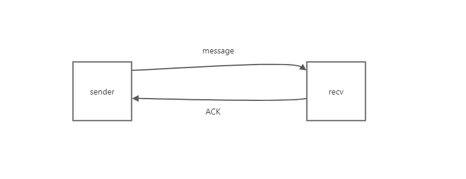
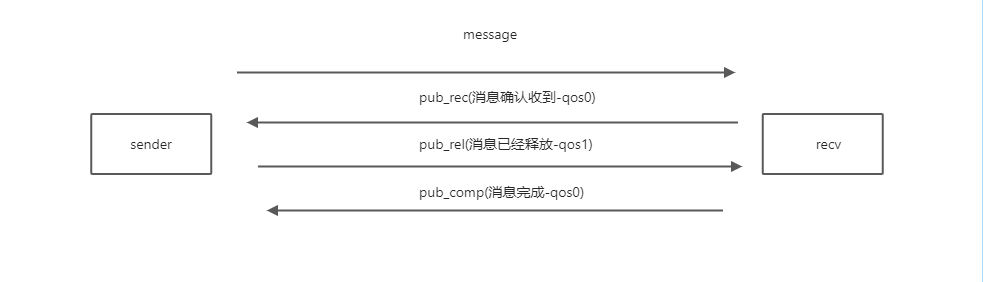

# 消息可靠投递

通过[消息不重复](./消息不重复.md)这一特性可以保证从**客户端A到服务端**这一条链路是通的.

那么怎么保证从**服务端到客户端B**这一条链路是通的呢?

 
### solution 1

1. 为每个用户维护一个seq,这个用户每接收一条消息或发送消息,seq就加1.
2. 当接收到一条消息时,检查当前的seq(as localSeq)和最新消息的seq(as serverSeq)是否是连续的.
3. 如果不是连续的,同步(localSeq,serverSeq)之间的消息到本地,然后更新localSeq为serverSeq.
4. 如果serverSeq小于localSeq,说明服务端没有收到本地的消息,那么就不需要同步了.

### solution 2

Qos 0/1/2

- Qos-0
    - 就正常发送消息,没有任何ACK操作
- Qos-1
    1. sender发送消息后,会启动一个任务来监听是否收到`ACK`包,否则会一直重试
    2. recv接收到消息后,发送`ACK`包给客户端.
    3. step1和step2可能会无限重复这个操作,直到消息接收方发出的ACK成功被sender接收到.(根据需要,可以设计一个最大重试次数,超时后任务自动停止)
- Qos-2
    1. sender发送消息后,会启动一个任务来监听是否收到`pub_rec`包,否则会一直重试
    2. recv收到消息后,会启动一个任务发送一个`pub_rec`给sender,直到收到了sender发送的`pub_rel`(qos0)包
    3. sender接收到了`pub_rec`后,会停止step1中的任务,并启动一个任务并发送`pub_rel`(qos1)给recv,直到收到了recv发送的`pub_comp`包
    4. recv接收到了`pub_rel`后,会停止step2中的任务,并启动一个任务并发送`pub_comp`(qos0)给sender
    5. sender接收到了`pub_comp`后,会停止step3中的任务

#### qos-1

#### qos-2

### 实现选择?