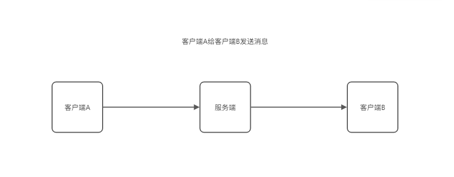

# 消息可靠投递

通过[消息不重复](./消息不重复.md)这一特性可以保证从**客户端A到服务端**这一条链路是通的.

那么怎么保证从**服务端到客户端B**这一条链路是通的呢?

### solution 1
1. 为每个用户维护一个seq,这个用户每接收一条或者发送一条消息,seq就加1.
2. 当接收到一条消息时,检查当前的seq(as localSeq)和最新消息的seq(as serverSeq)是否是连续的.
3. 如果不是连续的,同步(localSeq,serverSeq)之间的消息到本地,然后更新localSeq为serverSeq.
4. 如果serverSeq小于localSeq,说明服务端没有收到本地的消息,那么就不需要同步了.

### solution 2

todo
